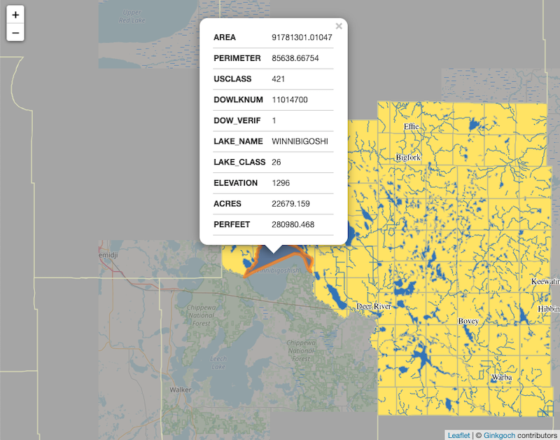

# Map Plugins
Plugins are allowed to load customized map instances with you your plugin file. Follow the steps below to create your own plugins.

This project includes a `workshop` map. Visit [this page](http://ec2-3-135-237-227.us-east-2.compute.amazonaws.com:3000/docs/) that hosts this map on AWS.

> NOTE: This demo is hosted on `AWS Free Tier EC2`. Should be higher performance locally with multiple cores.

## Launch workshop map server

```bash
git clone https://github.com/ginkgoch/map-restful-plugins.git
cd map-restful-plugins
npm i
npm start serve
```

Visit [http://localhost:3000/docs](http://localhost:3000/docs). Here is also a deployed demo for this plugin: http://ec2-3-135-237-227.us-east-2.compute.amazonaws.com:3000/docs/index.html. It is hosted on AWS free tier EC2 instance.



## Create your own map plugin
Creating a new plugin is easy. Just follow few steps below.
1. Copy the plugin template as your own plugin file. `cp plugin.js.template my-map-plugin.js` 
2. Update the plugin code with your own data and styles
3. Re-boot `map-restful-cli` by command `map-restful serve -e .` 

The server automatically discovers the plugins and load it. The map engine name will be used as the identification in the RESTful route. More API reference could refer [koa-map-router](https://github.com/ginkgoch/koa-map-router) project; and more `map-restful-cli` command options could refer [map-restful-cli](https://github.com/ginkgoch/map-restful-cli) project.

## Next target
Define an easy-to-read JSON schema and support to load maps dynamically from files without writing plugins.